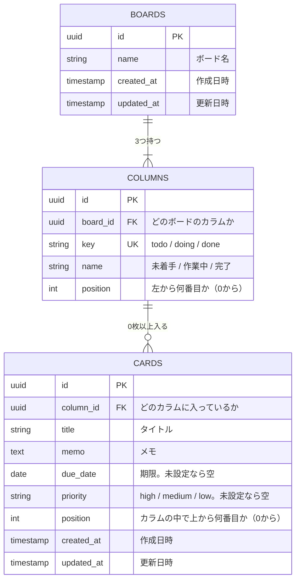
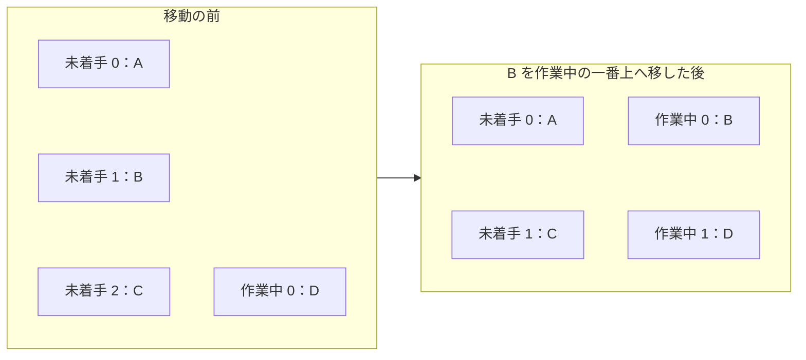

# タスク管理アプリ データ設計

データについての要件と設計をまとめる。カードとボードのデータの形、ER図、データベースのテーブルの定義を書く。

もとにする文書は、[要件定義書](要件定義書.md)と[機能要件](機能要件.md)。使うデータベースの具体的な製品は、[技術スタック](技術スタック.md)で決める。

## 1. カード

カード1件は、次の項目を持つ。

| 項目 | 形式 | 例 |
| --- | --- | --- |
| id | 文字列。カードごとに重ならない値 | `3f2a9c1e-...` |
| title | 文字列 | `要件定義書を書く` |
| memo | 文字列 | `機能と保存方法をまとめる` |
| dueDate | 日付の文字列、または未設定 | `2026-10-15` |
| priority | `high` / `medium` / `low`、または未設定 | `high` |

- 画面の「高」「中」「低」は、データでは `high`、`medium`、`low` とする
- `id` は画面に出さない

## 2. ボード

### 2.1 要件

- ボードは、すべてのカードと、各カラムにどのカードがどの順番で入っているかを持つ
- バックアップのファイルの形は、第1段階と第2段階で同じにする
- データの形が将来変わっても見分けられるように、データの版（バージョン）を一緒に保存する

### 2.2 画面の中で持つデータ

画面の中では、ボード全体を次の形で持つ。第1段階で `localStorage` に保存する形と、バックアップのファイルの形も、これと同じにする。

```json
{
  "version": 1,
  "columns": {
    "todo": ["c-001", "c-002"],
    "doing": ["c-003"],
    "done": []
  },
  "cards": {
    "c-001": {
      "id": "c-001",
      "title": "要件定義書を書く",
      "memo": "機能と保存方法をまとめる",
      "dueDate": "2026-10-15",
      "priority": "high"
    },
    "c-002": {
      "id": "c-002",
      "title": "設計書を書く",
      "memo": "",
      "dueDate": null,
      "priority": null
    },
    "c-003": {
      "id": "c-003",
      "title": "画面を作る",
      "memo": "",
      "dueDate": "2026-10-20",
      "priority": "medium"
    }
  }
}
```

| 項目 | 内容 |
| --- | --- |
| `version` | データの形の版。今は `1` |
| `columns` | カラムごとに、入っているカードの id を、上から順に並べたもの。カラムは `todo`（未着手）、`doing`（作業中）、`done`（完了）の3つ |
| `cards` | カードの id をキーにして、カードの中身を引けるようにしたもの |

- カードの並び順は、`columns` の配列の順番で表す
- 1枚のカードは、必ずどれか1つのカラムに、1回だけ入る
- カードの id は、カードを作るときに画面の側で作る。重ならない値（UUID）を使う。サーバーの返事を待たずに画面へ出せるようにするためである（[基本設計書](基本設計書.md) 2.3 参照）
- 書き出したファイルには、このほかに書き出した日時 `exportedAt` を入れる

## 3. データベース（第2段階）

### 3.1 要件

- ボード、カラム、カードを、データベースのテーブルとして持つ
- テーブルの形とつながりは、3.2 の ER 図で決める
- カードの作成日時と更新日時も記録する

### 3.2 ER図

データベースには、ボード、カラム、カードの3つのテーブルを作る。利用者は自分1人なので、ユーザーのテーブルは作らない。



ボードは1つだけだが、テーブルとしては作っておく。「カラムはボードに属する」というつながりを、データの形で表すためである。

### 3.3 テーブルの定義

**BOARDS（ボード）**

| 列 | 型 | 空を許すか | 決まり |
| --- | --- | --- | --- |
| id | UUID | 許さない | 主キー |
| name | 文字列（100文字まで） | 許さない | |
| created_at | 日時 | 許さない | 作ったときの日時を自動で入れる |
| updated_at | 日時 | 許さない | 変えたときの日時を自動で入れる |

**COLUMNS（カラム）**

| 列 | 型 | 空を許すか | 決まり |
| --- | --- | --- | --- |
| id | UUID | 許さない | 主キー |
| board_id | UUID | 許さない | BOARDS の id を指す |
| key | 文字列 | 許さない | `todo`、`doing`、`done` のどれか。同じボードの中で重ならない |
| name | 文字列（20文字まで） | 許さない | |
| position | 整数 | 許さない | 0 以上 |

**CARDS（カード）**

| 列 | 型 | 空を許すか | 決まり |
| --- | --- | --- | --- |
| id | UUID | 許さない | 主キー。画面の側で作った値を使う |
| column_id | UUID | 許さない | COLUMNS の id を指す |
| title | 文字列（100文字まで） | 許さない | 空の文字は入れない |
| memo | 長い文字列（1000文字まで） | 許さない | 未入力なら空の文字を入れる |
| due_date | 日付 | 許す | |
| priority | 文字列 | 許す | `high`、`medium`、`low` のどれか |
| position | 整数 | 許さない | 0 以上 |
| created_at | 日時 | 許さない | 作ったときの日時を自動で入れる |
| updated_at | 日時 | 許さない | 変えたときの日時を自動で入れる |

- ボード1つとカラム3つは、データベースを最初に作るときに入れておく。画面から増やしたり消したりはしない
- 作成日時と更新日時は、データベースにだけ持つ。画面とバックアップのファイルには含めない。そのため、バックアップを読み込むと、作成日時と更新日時は読み込んだ日時になる

### 3.4 並び順の持ち方

カードの並び順は、CARDS の `position` に、カラムの中で上から 0、1、2… と番号を振って持つ。

カードを移動したときは、移動元と移動先のカラムで、番号を振り直す。



- 振り直しは、1回の移動につき、関係するカードの番号をまとめて変える。途中で失敗したときは、全部を元に戻す（トランザクション。[非機能要件](非機能要件.md) 3章）
- カードは合計 200 枚までを想定しているので、毎回振り直しても速さに問題はない

### 3.5 画面のデータとテーブルの対応

| 画面の中のデータ | テーブルの列 |
| --- | --- |
| `columns` のキー（`todo` など） | COLUMNS.key |
| `columns` の配列の何番目か | CARDS.position |
| `cards` の id | CARDS.id |
| `title` | CARDS.title |
| `memo` | CARDS.memo |
| `dueDate` | CARDS.due_date |
| `priority` | CARDS.priority |

サーバーは、テーブルから読み出したデータを 2.2 の形に組み立ててから、画面に返す。
