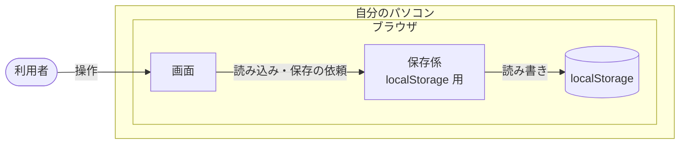
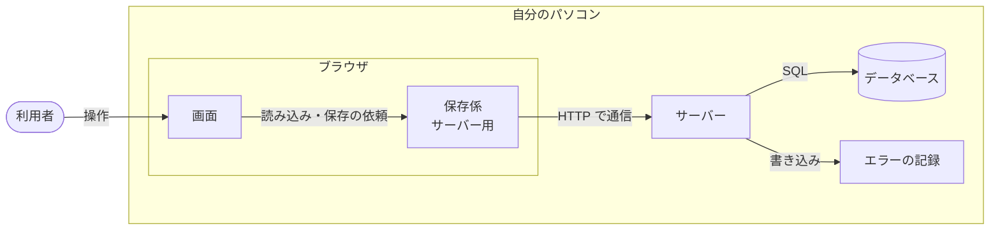
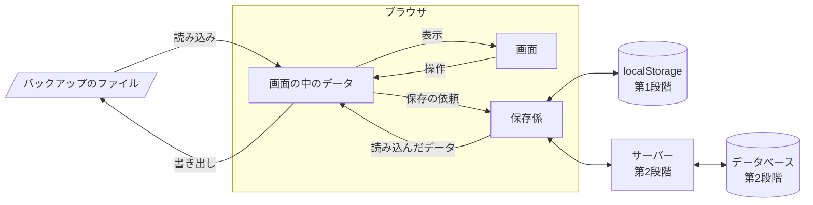
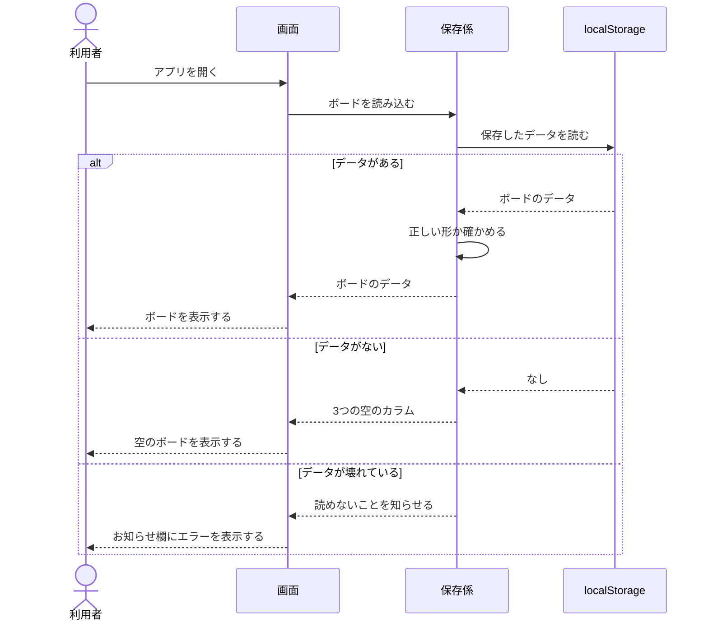
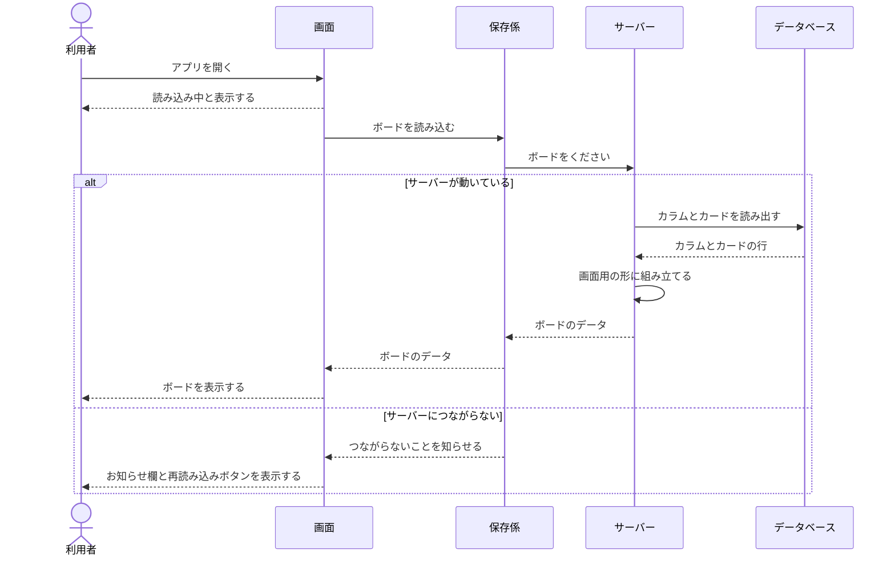
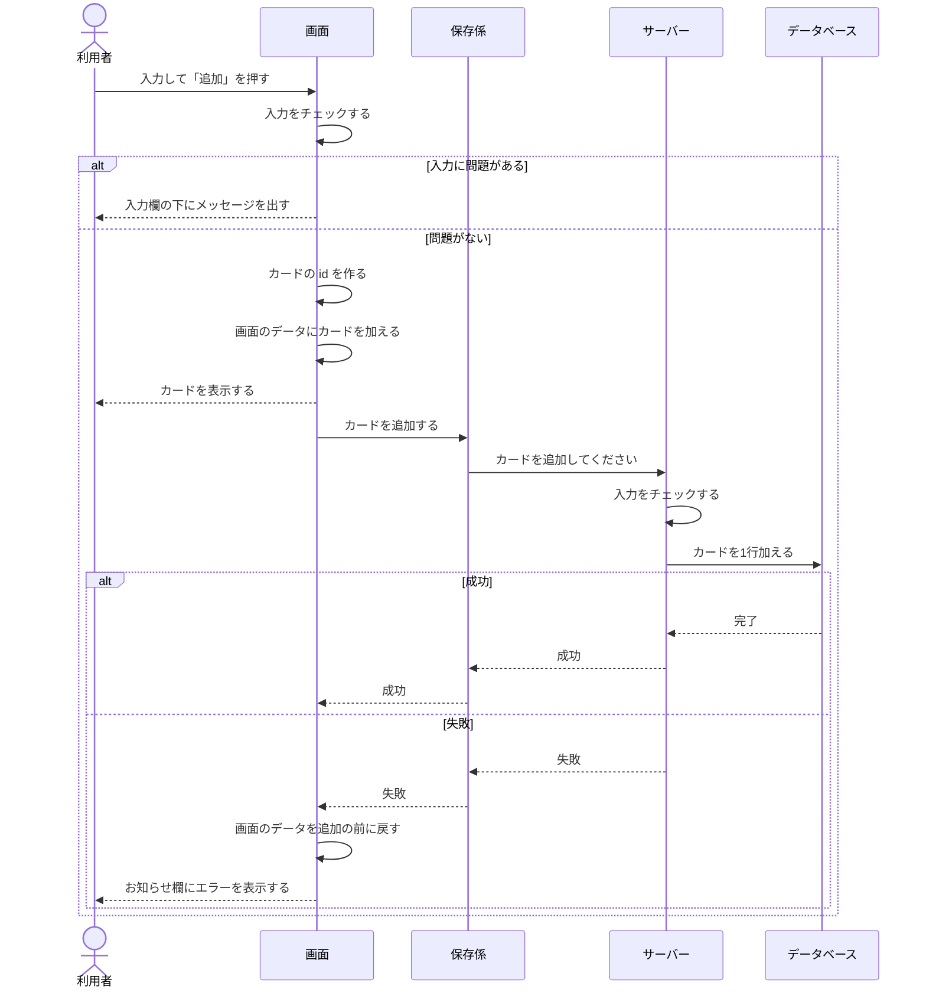
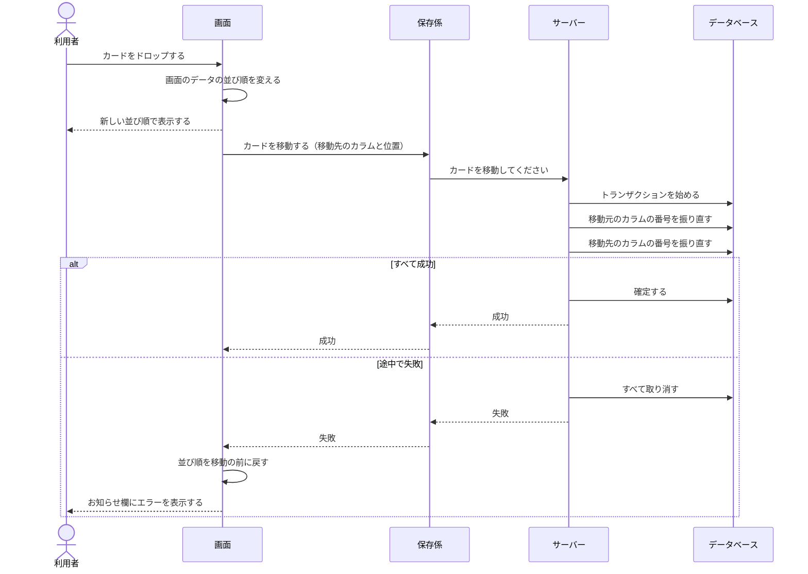
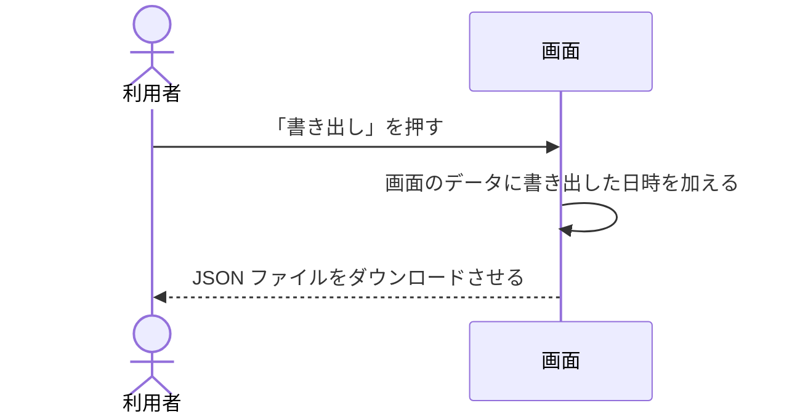
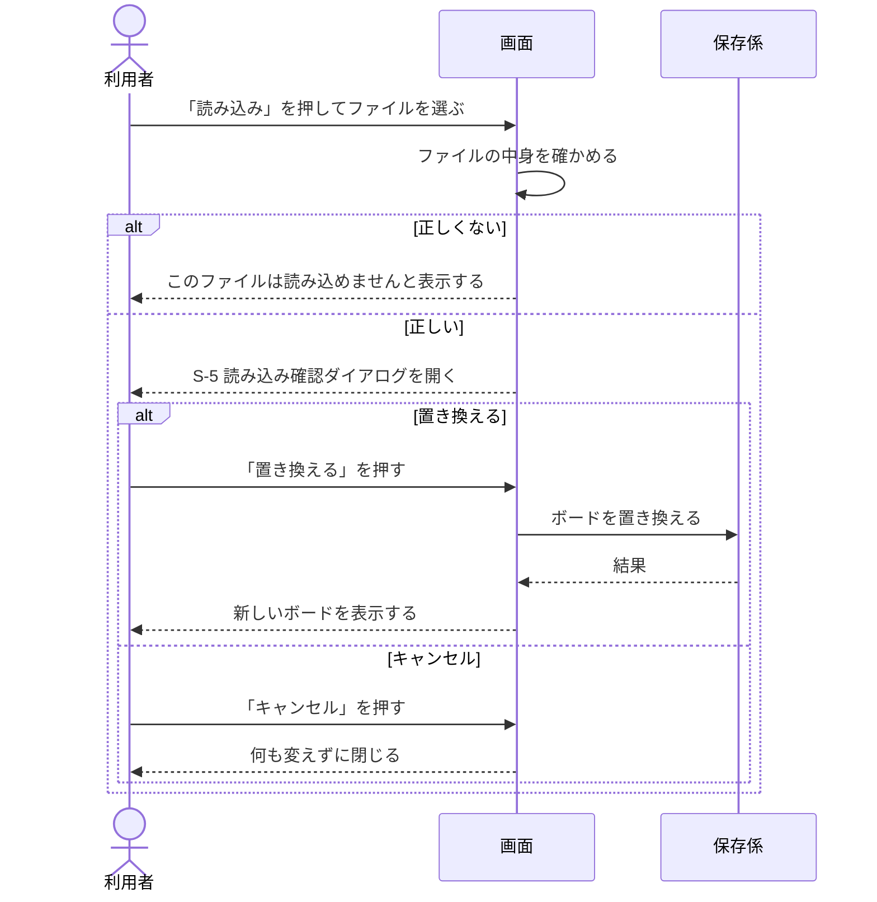

# タスク管理アプリ 基本設計書

| 項目 | 内容 |
| --- | --- |
| 文書名 | タスク管理アプリ 基本設計書 |
| 版 | 0.2 |
| 作成日 | 2026-10-10 |
| 更新日 | 2026-10-11 |
| 状態 | ドラフト |
| もとにする文書 | [要件定義書](要件定義書.md) 0.4 |

## 改訂履歴

| 版 | 日付 | 内容 |
| --- | --- | --- |
| 0.1 | 2026-10-10 | 初版 |
| 0.2 | 2026-10-11 | 画面設計とデータ設計を別の文書に分ける。この文書には、システム構成、データの流れ、サーバーの窓口を残す |

## 0. この文書について

要件定義書で決めた「何を作るか」をもとに、「どう作るか」を決める。図は Mermaid 記法で書く。

画面とデータの設計は、次の文書に分けて書く。

| 文書 | 内容 |
| --- | --- |
| [画面設計](画面設計.md) | 画面ごとの項目、表示のルール、画面の移り方、入力のチェック |
| [データ設計](データ設計.md) | データの形、ER図、テーブルの定義、並び順の持ち方 |

この文書では、使うデータベースやサーバーの具体的な製品は決めない。それらは、この文書のあとで決め、[技術スタック](技術スタック.md)に書く。

## 1. システム構成

### 1.1 第1段階

画面だけで動き、データはブラウザの `localStorage` に保存する。

### 1.2 第2段階

画面、サーバー、データベースの3つに分かれる。3つとも自分のパソコンの上で動く。

### 1.3 保存係で保存先を差し替える

画面は、データを保存するときに「保存係」に頼むだけにする。保存係は、保存先ごとに2つ作る。

- 第1段階：`localStorage` に保存する保存係
- 第2段階：サーバーに保存を頼む保存係

画面から見ると、どちらの保存係も同じ頼み方で使える。そのため、第2段階で保存係を入れ替えても、画面の部品は書き換えずに済む（[非機能要件](非機能要件.md) 7章）。

保存係が引き受ける仕事は次のとおり。

| 仕事 | 内容 |
| --- | --- |
| ボードを読み込む | ボード全体のデータを返す |
| カードを追加する | 指定したカラムの一番下に、カードを1枚加える |
| カードを更新する | カードの4項目を書き換える |
| カードを削除する | カードを1枚消す |
| カードを移動する | カードを、指定したカラムの指定した位置へ移す。同じカラムの中の並べ替えも含む |
| ボードを置き換える | バックアップの読み込みで、ボード全体を入れ替える |

## 2. データの流れ

### 2.1 全体

### 2.2 アプリを開いたとき

第1段階

壊れたデータは消さずに残す（[非機能要件](非機能要件.md) 3章）。

第2段階

### 2.3 カードを追加、編集、削除したとき

画面のデータを先に書き換えて表示し、そのあとで保存する。保存に失敗したときは、画面のデータを操作の前に戻す。

こうすると、サーバーの返事を待たずに結果が画面に出るので、操作が速く感じられる（[非機能要件](非機能要件.md) 2章）。特にドラッグ＆ドロップでは、返事を待つ間にカードが元の位置へ一瞬戻ってしまうことを防げる。

次の図は、第2段階でカードを追加するときの流れ。編集と削除も同じ流れになる。

第1段階では、サーバーとデータベースの代わりに、保存係がボード全体を `localStorage` へ書き込む。

### 2.4 カードを移動、並べ替えたとき（第2段階）

番号の振り直し方は、[データ設計](データ設計.md) 3.4 に書く。

### 2.5 バックアップを書き出したとき

画面の中のデータを、そのままファイルにする。第2段階でも、サーバーには問い合わせない。

### 2.6 バックアップを読み込んだとき

第2段階では、サーバーが「今のカードを全部消して、ファイルのカードを入れる」を1つのトランザクションで行う。途中で失敗したときは、読み込む前のボードのまま残る。

ファイルの中身は、次をすべて満たすときに正しいとする。

- JSON として読める
- `version` が `1`
- `columns` に `todo`、`doing`、`done` の3つがそろっている
- すべてのカードが、[画面設計](画面設計.md) 10章の入力のチェックを満たす
- すべてのカードが、どれか1つのカラムに1回だけ入っている
- `columns` に、`cards` にない id が入っていない

## 3. サーバーの窓口（第2段階）

画面の保存係がサーバーに頼むときの窓口（API）を、次のように分ける。送るデータと返すデータの細かい形は、詳細設計で決める。

表の中の「ボードの形」は、[データ設計](データ設計.md) 2.2 の形を指す。

| 保存係の仕事 | 方法 | 窓口 | 内容 |
| --- | --- | --- | --- |
| ボードを読み込む | GET | `/api/board` | ボード全体をボードの形で返す |
| カードを追加する | POST | `/api/cards` | カードと、追加するカラムを送る |
| カードを更新する | PATCH | `/api/cards/{id}` | 変えた項目を送る |
| カードを削除する | DELETE | `/api/cards/{id}` | |
| カードを移動する | PUT | `/api/cards/{id}/position` | 移動先のカラムと、上から何番目かを送る |
| ボードを置き換える | PUT | `/api/board` | ボードの形のボード全体を送る |

- サーバーは、同じパソコンからの接続だけを受け付ける（[非機能要件](非機能要件.md) 6章）
- サーバーで起きたエラーは、日時と内容をエラーの記録に残す（[非機能要件](非機能要件.md) 4章）

## 4. あとで決めること

| 内容 | 決める時期 |
| --- | --- |
| データベースとサーバーに使う製品と言語 | 技術選定（[技術スタック](技術スタック.md) 2章） |
| テーブルの作成や変更の手順の残し方 | 技術選定（[技術スタック](技術スタック.md) 2章） |
| 窓口ごとの、送るデータと返すデータの細かい形 | 詳細設計 |
| 色、余白、文字の大きさ | 詳細設計 |
| 起動、停止、バックアップ、復元の手順書 | 第2段階の実装のとき |
