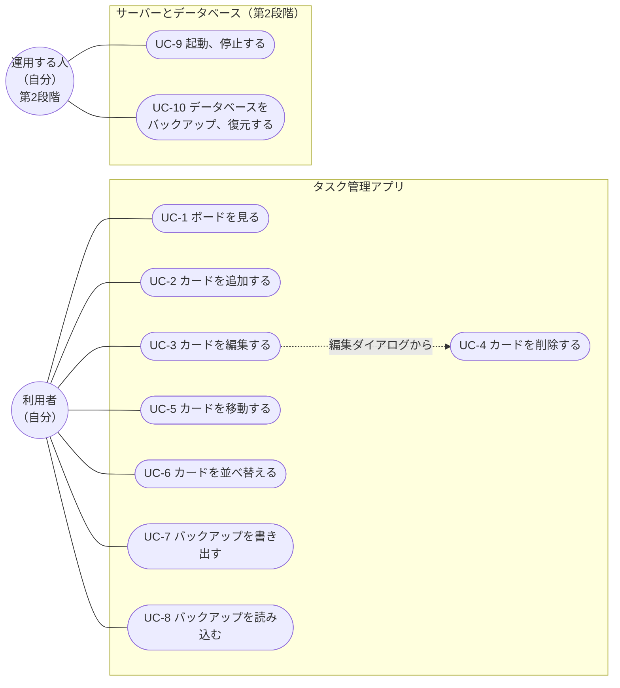

# タスク管理アプリ 機能要件

[要件定義書](要件定義書.md)のうち、機能についての要件をまとめる。機能の一覧、利用者ができること（ユースケース）、操作の流れ、機能ごとの要件の順に書く。

## 1. 機能一覧

| 番号 | 機能 | 概要 | 段階 | 詳しくは |
| --- | --- | --- | --- | --- |
| F-1 | ボードを表示する | 3つのカラムと、そこにあるカードを並べて表示する | 第1段階 | 4.1 |
| F-2 | カードを追加する | タイトル、メモ、期限、優先度を入力して、カードを追加する | 第1段階 | 4.2 |
| F-3 | カードを編集する | カードの内容を書き換える | 第1段階 | 4.3 |
| F-4 | カードを削除する | 確認のあとで、カードを消す | 第1段階 | 4.4 |
| F-5 | ドラッグ＆ドロップで移動する | カードを別のカラムへ移す。同じカラムの中で並べ替える | 第1段階 | 4.5 |
| F-6 | キーボードで操作する | マウスを使わずに、すべての操作をする | 第1段階 | 4.6 |
| F-7 | 保存する | 変更のたびに、すぐ保存する | 第1段階は `localStorage`、第2段階はデータベース | 4.7 |
| F-8 | バックアップする | ボード全体をファイルに書き出し、ファイルから読み込む | 第1段階 | 4.8 |

## 2. ユースケース

利用者（自分）がこのアプリでできることを、次の表にまとめる。

| 番号 | ユースケース | 概要 |
| --- | --- | --- |
| UC-1 | ボードを見る | 3つのカラムと、そこにあるカードを一覧する |
| UC-2 | カードを追加する | 新しいタスクをカードとして登録する |
| UC-3 | カードを編集する | カードの内容を書き換える |
| UC-4 | カードを削除する | 不要になったカードを消す |
| UC-5 | カードを移動する | カードを別のカラムへ移し、タスクの状態を変える |
| UC-6 | カードを並べ替える | 同じカラムの中で、カードの順番を変える |
| UC-7 | バックアップを書き出す | ボード全体のデータをファイルに保存する |
| UC-8 | バックアップを読み込む | 書き出したファイルから、ボード全体を元に戻す |

第2段階では、利用者が「運用する人」として次も行う。

| 番号 | ユースケース | 概要 |
| --- | --- | --- |
| UC-9 | 起動、停止する | データベースとサーバーを起動し、使い終わったら停止する |
| UC-10 | データベースをバックアップ、復元する | データベースの中身を丸ごと保存し、必要なときに元に戻す |

### 2.1 ユースケース図

利用者と運用する人は、どちらも自分である。役割の違いがわかるように、図では分けて書く。

UC-4 カードを削除する は、UC-3 の編集ダイアログの中から行う。

## 3. 操作フロー

各ユースケースで、利用者がどう操作し、アプリがどう応えるかを示す。UC-1 から UC-8 の操作は、第1段階と第2段階で同じとする。

### UC-1 ボードを見る

1. 利用者がブラウザでアプリを開く
2. アプリは保存したデータを読み込み、ボード画面を表示する
3. 保存したデータがないときは、3つの空のカラムを表示する

### UC-2 カードを追加する

1. 利用者が、カラムの下にある「カードを追加」を押す
2. アプリは、そのカラムの中に入力欄を開く
3. 利用者がタイトルなどを入力し、「追加」を押す
4. アプリは、そのカラムの一番下にカードを入れ、保存する
5. 「キャンセル」を押した場合は、何も追加せずに入力欄を閉じる

### UC-3 カードを編集する

1. 利用者がカードをクリックする
2. アプリは編集ダイアログを開き、今の内容を表示する
3. 利用者が内容を書き換え、「保存」を押す
4. アプリはカードを更新して保存し、ダイアログを閉じる
5. 「キャンセル」を押した場合は、変更を捨ててダイアログを閉じる

### UC-4 カードを削除する

1. 利用者が編集ダイアログで「削除」を押す
2. アプリは「本当に削除しますか？」と確認を出す
3. 利用者が「OK」を押すと、カードを消して保存し、ダイアログを閉じる
4. 「キャンセル」を押すと、消さずに編集ダイアログへ戻る

### UC-5 カードを移動する ／ UC-6 カードを並べ替える

1. 利用者がカードをつかみ、移したい位置まで動かす
2. アプリは、動かしている間、入る位置がわかるように表示する
3. 利用者がカードを離す
4. アプリは、離した位置にカードを入れて保存する

### UC-7 バックアップを書き出す

1. 利用者が、ボード画面の「書き出し」を押す
2. アプリは、ボード全体のデータを1つのファイルとしてダウンロードさせる

### UC-8 バックアップを読み込む

1. 利用者が、ボード画面の「読み込み」を押し、ファイルを選ぶ
2. アプリは「今のボードは、読み込んだ内容で置き換わります。よろしいですか？」と確認を出す
3. 利用者が「OK」を押すと、ボードを読み込んだ内容に置き換えて保存する
4. 「キャンセル」を押すと、何も変えない
5. ファイルの中身が正しくないときは、エラーを表示し、ボードは変えない

### UC-9 起動、停止する（第2段階）

1. 利用者が、手順書どおりにデータベースとサーバーを起動する
2. ブラウザでアプリを開いて使う
3. 使い終わったら、手順書どおりにサーバーとデータベースを停止する

### UC-10 データベースをバックアップ、復元する（第2段階）

1. 利用者が、手順書どおりにデータベースのバックアップを取る
2. データが壊れたり消えたりしたときは、手順書どおりにバックアップから復元する
3. 復元したあとにアプリを開き、ボードが元に戻っていることを確かめる

## 4. 機能要件

画面ごとの項目や文言は、[画面設計](画面設計.md)に書く。

### 4.1 ボードを表示する

- 3つのカラムを、左から「未着手」「作業中」「完了」の順に横に並べて表示する
- 各カラムには、そのカラムのカードを上から順に表示する
- カードには、タイトル、期限、優先度を表示する

### 4.2 カードを追加する

カラムごとの「カードを追加」から、次の項目を入力して追加する。

| 項目 | 入力 | 内容 |
| --- | --- | --- |
| タイトル | 必須 | 1行の文字 |
| メモ | 任意 | 複数行の文字 |
| 期限 | 任意 | 日付（年・月・日）。カレンダーから選べる |
| 優先度 | 任意 | 高、中、低から1つ |

- 追加したカードは、そのカラムの一番下に入る
- 入力内容の細かいルール（文字数の上限など）は、[画面設計](画面設計.md) 10章で決める

### 4.3 カードを編集する

- カードをクリックすると、編集ダイアログが開く
- タイトル、メモ、期限、優先度を書き換えられる
- 「保存」で内容を更新し、「キャンセル」では変更前の内容のままにする

### 4.4 カードを削除する

- 編集ダイアログの「削除」で、カードを消す
- 消す前に確認を出し、「キャンセル」を選ぶと消さずに残す

### 4.5 ドラッグ＆ドロップで移動する

- カードを別のカラムへドロップすると、そのカラムへ移動する。これでタスクの状態が変わる
- ドロップした位置にカードを入れる
- 同じカラムの中でも、ドロップした位置へ並べ替えられる
- 並び順は手で決めた順番のままとし、自動では並べ替えない

### 4.6 キーボードで操作する

マウスを使わずに、すべての操作ができるようにする。

| 操作 | キー |
| --- | --- |
| ボタンやカードの間を移る | Tab（戻るときは Shift + Tab） |
| ボタンを押す、カードの編集ダイアログを開く | Enter |
| ダイアログを閉じる（キャンセルと同じ） | Esc |
| カードをつかむ、離す | Space |
| つかんだカードを動かす | 矢印キー |
| つかんだカードを元の位置へ戻す | Esc |

- 今どこを選んでいるかが、見た目でわかるようにする

### 4.7 保存する

- 追加、編集、削除、移動、並べ替え、読み込みのたびに、すぐ保存する
- 第1段階では、ボード全体をブラウザの `localStorage` へ保存する
- 第2段階では、サーバーを通してデータベースへ保存する
- 画面を開いたときは、保存したデータを読み込む
- 保存したデータがないときは、3つの空のカラムから始める
- 保存に失敗したときは、画面にエラーを表示する
- 第2段階で、サーバーやデータベースが止まっていてつながらないときは、そのことを画面に表示する

保存するデータの形は、[データ設計](データ設計.md)に書く。

### 4.8 バックアップする

- 「書き出し」で、ボード全体を JSON 形式のファイルとしてダウンロードする
- ファイル名には書き出した日付を入れる（例：`task-board-2026-10-10.json`）
- 「読み込み」で、書き出したファイルを選ぶと、確認のあとでボード全体を置き換える
- 正しくないファイルを選んだときは、エラーを表示し、ボードは変えない
- 第1段階で書き出したファイルを、第2段階で読み込めるようにする。これを第1段階から第2段階へのデータの引っ越しに使う
