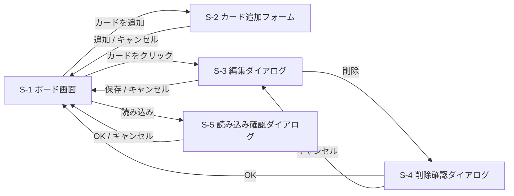
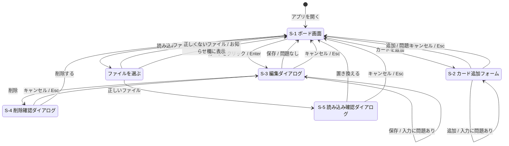

# タスク管理アプリ 画面設計

画面についての要件と設計をまとめる。前半（1〜3章）は、どんな画面があるかという要件。後半（4〜10章）は、画面ごとの項目や表示のルールという設計である。

もとにする文書は、[要件定義書](要件定義書.md)と[機能要件](機能要件.md)。

## 1. 画面の一覧

| 番号 | 画面 | 内容 |
| --- | --- | --- |
| S-1 | ボード画面 | アプリを開くと表示されるメインの画面。3つのカラムとカードを並べる |
| S-2 | カード追加フォーム | カラムの中に開く入力欄。別の画面には移らない |
| S-3 | 編集ダイアログ | カードをクリックすると、ボード画面の上に重ねて開く |
| S-4 | 削除確認ダイアログ | 編集ダイアログで「削除」を押すと開く |
| S-5 | 読み込み確認ダイアログ | バックアップを読み込む前に開く |

画面ごとの項目、ボタン、表示のルールは、4章以降で決める。

## 2. 画面の移り方

### 2.1 概要



### 2.2 キーボード操作とエラーを含めた移り方

2.1 の図に、キーボード操作とエラーのときの動きを加えたもの。



## 3. 画面のイメージ

S-1 ボード画面

```text
+--------------------------------------------------------------------+
| タスク管理                                      [書き出し] [読み込み] |
+--------------------------------------------------------------------+
| 未着手              | 作業中              | 完了                     |
| +----------------+ | +----------------+ | +----------------+        |
| | 要件定義書を書く | | | 画面を作る       | | | リポジトリを作る |        |
| | 10/15  優先度:高 | | | 10/20  優先度:中 | | |                |        |
| +----------------+ | +----------------+ | +----------------+        |
| +----------------+ |                    |                          |
| | 設計書を書く     | |                    |                          |
| +----------------+ |                    |                          |
| [+ カードを追加]    | [+ カードを追加]    | [+ カードを追加]          |
+--------------------------------------------------------------------+
```

S-3 編集ダイアログ

```text
+------------------------------------+
| カードを編集                         |
|                                    |
| タイトル [要件定義書を書く          ] |
| メモ     [機能と保存方法をまとめる   ] |
|          [                         ] |
| 期限     [2026-10-15] (カレンダー)   |
| 優先度   [高 ▼]                     |
|                                    |
| [削除]            [キャンセル] [保存] |
+------------------------------------+
```

見た目の細かい部分（色、余白、文字の大きさ）は、詳細設計で決める。

## 4. すべての画面に共通するルール

| 項目 | ルール |
| --- | --- |
| 画面の幅 | 横幅 1280px 以上で、3つのカラムが横に並ぶ |
| 選択中の表示 | キーボードで選んでいるボタンやカードには、太い枠線を出す |
| ダイアログ | 開いている間は、後ろのボード画面を操作できない。開いたときは、ダイアログの最初の入力欄かボタンを選んだ状態にする。閉じたときは、開く前に選んでいた場所に戻る |
| Esc キー | 開いているダイアログやフォームを、キャンセルと同じ扱いで閉じる |
| 色だけに頼らない | 優先度や期限切れは、色に加えて文字でも示す |

## 5. S-1 ボード画面

**表示する項目**

| 場所 | 項目 | 内容 |
| --- | --- | --- |
| 上部 | アプリ名 | 「タスク管理」 |
| 上部 | 「書き出し」ボタン | バックアップを書き出す |
| 上部 | 「読み込み」ボタン | バックアップのファイルを選ぶ |
| 上部 | お知らせ欄 | エラーや、つながらないことを知らせる。知らせることがないときは出さない |
| 中央 | カラム | 左から「未着手」「作業中」「完了」 |
| カラムの見出し | カラム名と枚数 | 例：「未着手（3）」 |
| カラムの中 | カード | 並び順どおりに上から表示する |
| カラムの下 | 「＋ カードを追加」ボタン | S-2 を開く |

**カードに表示する項目**

| 項目 | 表示のルール |
| --- | --- |
| タイトル | 全部表示する。長いときは折り返す |
| 期限 | 未設定なら出さない。今年なら「10/15」、今年以外なら「2027/1/5」の形で出す |
| 期限切れ | 期限が今日より前で、かつ「完了」以外のカラムにあるときは、期限を赤くし「期限切れ」と添える |
| 優先度 | 未設定なら出さない。「高」「中」「低」の文字を、色付きの小さな札で出す |
| メモ | カードには出さない。編集ダイアログで見る |

**状態ごとの表示**

| 状態 | 表示 |
| --- | --- |
| カードが1枚もないカラム | 「カードはありません」と薄く出す |
| 読み込み中（第2段階） | ボードの代わりに「読み込み中…」と出す |
| サーバーにつながらない（第2段階） | お知らせ欄に「サーバーにつながりません。サーバーが起動しているか確かめてください」と出し、「再読み込み」ボタンを置く |
| 保存に失敗した | お知らせ欄に「保存できませんでした。もう一度操作してください」と出す |

## 6. S-2 カード追加フォーム

カラムの中、カードの一番下に開く。

| 項目 | 部品 | 内容 |
| --- | --- | --- |
| タイトル | 1行の入力欄 | 開いたときに、ここを選んだ状態にする |
| メモ | 複数行の入力欄 | |
| 期限 | 日付の入力欄 | カレンダーから選べる。空にもできる |
| 優先度 | 選択欄 | 「なし」「高」「中」「低」。最初は「なし」 |
| 「追加」ボタン | ボタン | 入力をチェックし、問題がなければカードを追加して閉じる |
| 「キャンセル」ボタン | ボタン | 何も追加せずに閉じる |

- タイトルの入力欄で Enter を押すと、「追加」と同じ扱いにする
- 開けるフォームは同時に1つだけとする。別のカラムで開くと、前のフォームは閉じる

## 7. S-3 編集ダイアログ

| 項目 | 部品 | 内容 |
| --- | --- | --- |
| タイトル | 1行の入力欄 | 今の値を入れて開く |
| メモ | 複数行の入力欄 | 今の値を入れて開く |
| 期限 | 日付の入力欄 | 今の値を入れて開く |
| 優先度 | 選択欄 | 今の値を入れて開く |
| 「削除」ボタン | ボタン | S-4 を開く。誤って押さないよう、左端に離して置く |
| 「キャンセル」ボタン | ボタン | 変更を捨てて閉じる |
| 「保存」ボタン | ボタン | 入力をチェックし、問題がなければ更新して閉じる |

## 8. S-4 削除確認ダイアログ

| 項目 | 内容 |
| --- | --- |
| 文言 | 「『（カードのタイトル）』を削除しますか？ 元に戻せません。」 |
| 「キャンセル」ボタン | 消さずに S-3 へ戻る。開いたときは、こちらを選んだ状態にする |
| 「削除する」ボタン | カードを消し、ボード画面へ戻る |

うっかり Enter を押しても消えないように、最初は「キャンセル」を選んだ状態で開く。

## 9. S-5 読み込み確認ダイアログ

| 項目 | 内容 |
| --- | --- |
| 文言 | 「今のボードは、読み込んだ内容で置き換わります。よろしいですか？」 |
| 読み込む内容 | ファイル名と、カードの枚数を出す。例：「task-board-2026-10-10.json（カード 12 枚）」 |
| 「キャンセル」ボタン | 何も変えずに閉じる。開いたときは、こちらを選んだ状態にする |
| 「置き換える」ボタン | ボードを置き換えて閉じる |

ファイルの中身が正しくないときは、このダイアログを開かず、お知らせ欄に「このファイルは読み込めません」と出す。

## 10. 入力のチェック

S-2 と S-3 で共通のルールとする。

| 項目 | ルール | 守られていないときのメッセージ |
| --- | --- | --- |
| タイトル | 前後の空白を取り除いたうえで、1文字以上 | 「タイトルを入力してください」 |
| タイトル | 100文字以内 | 「タイトルは100文字以内で入力してください」 |
| メモ | 1000文字以内 | 「メモは1000文字以内で入力してください」 |
| 期限 | 空、または正しい日付。今日より前の日付も入れられる | 「正しい日付を入力してください」 |
| 優先度 | なし、高、中、低のどれか | 選択欄なので、ほかの値は入らない |

- チェックは「追加」「保存」を押したときに行う
- 問題があるときは、その入力欄のすぐ下にメッセージを出し、フォームやダイアログは閉じない。問題のある最初の入力欄を選んだ状態にする
- タイトルの前後の空白は、取り除いてから保存する
- 第2段階では、サーバーも同じルールでチェックする。画面のチェックをすり抜けたデータを、データベースに入れないためである
