# タスク管理アプリ 基本設計書

| 項目 | 内容 |
| --- | --- |
| 文書名 | タスク管理アプリ 基本設計書 |
| 版 | 0.1 |
| 作成日 | 2026-10-10 |
| 状態 | ドラフト |
| もとにする文書 | 要件定義書 0.3 |

## 改訂履歴

| 版 | 日付 | 内容 |
| --- | --- | --- |
| 0.1 | 2026-10-10 | 初版 |

## 0. この文書について

要件定義書で決めた「何を作るか」をもとに、「どう作るか」を決める。図は Mermaid 記法で書く。

この文書では、使うデータベースやサーバーの具体的な製品は決めない。それらは、この文書のあとで技術選定として決める。

## 1. システム構成

### 1.1 第1段階

画面だけで動き、データはブラウザの `localStorage` に保存する。

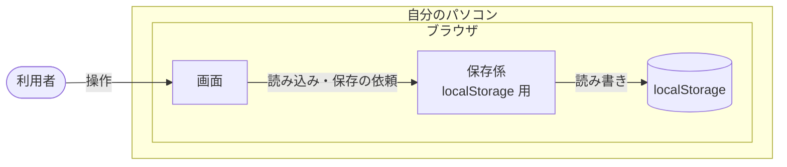

### 1.2 第2段階

画面、サーバー、データベースの3つに分かれる。3つとも自分のパソコンの上で動く。

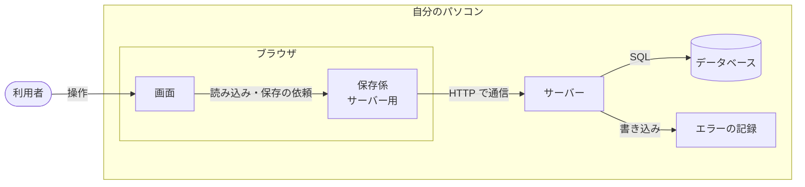

### 1.3 保存係で保存先を差し替える

画面は、データを保存するときに「保存係」に頼むだけにする。保存係は、保存先ごとに2つ作る。

- 第1段階：`localStorage` に保存する保存係
- 第2段階：サーバーに保存を頼む保存係

画面から見ると、どちらの保存係も同じ頼み方で使える。そのため、第2段階で保存係を入れ替えても、画面の部品は書き換えずに済む（要件定義書 9.7）。

保存係が引き受ける仕事は次のとおり。

| 仕事 | 内容 |
| --- | --- |
| ボードを読み込む | ボード全体のデータを返す |
| カードを追加する | 指定したカラムの一番下に、カードを1枚加える |
| カードを更新する | カードの4項目を書き換える |
| カードを削除する | カードを1枚消す |
| カードを移動する | カードを、指定したカラムの指定した位置へ移す。同じカラムの中の並べ替えも含む |
| ボードを置き換える | バックアップの読み込みで、ボード全体を入れ替える |

## 2. 画面設計

### 2.1 すべての画面に共通するルール

| 項目 | ルール |
| --- | --- |
| 画面の幅 | 横幅 1280px 以上で、3つのカラムが横に並ぶ |
| 選択中の表示 | キーボードで選んでいるボタンやカードには、太い枠線を出す |
| ダイアログ | 開いている間は、後ろのボード画面を操作できない。開いたときは、ダイアログの最初の入力欄かボタンを選んだ状態にする。閉じたときは、開く前に選んでいた場所に戻る |
| Esc キー | 開いているダイアログやフォームを、キャンセルと同じ扱いで閉じる |
| 色だけに頼らない | 優先度や期限切れは、色に加えて文字でも示す |

### 2.2 S-1 ボード画面

**表示する項目**

| 場所 | 項目 | 内容 |
| --- | --- | --- |
| 上部 | アプリ名 | 「タスク管理」 |
| 上部 | 「書き出し」ボタン | バックアップを書き出す |
| 上部 | 「読み込み」ボタン | バックアップのファイルを選ぶ |
| 上部 | お知らせ欄 | エラーや、つながらないことを知らせる。知らせることがないときは出さない |
| 中央 | カラム | 左から「未着手」「作業中」「完了」 |
| カラムの見出し | カラム名と枚数 | 例：「未着手（3）」 |
| カラムの中 | カード | 並び順どおりに上から表示する |
| カラムの下 | 「＋ カードを追加」ボタン | S-2 を開く |

**カードに表示する項目**

| 項目 | 表示のルール |
| --- | --- |
| タイトル | 全部表示する。長いときは折り返す |
| 期限 | 未設定なら出さない。今年なら「10/15」、今年以外なら「2027/1/5」の形で出す |
| 期限切れ | 期限が今日より前で、かつ「完了」以外のカラムにあるときは、期限を赤くし「期限切れ」と添える |
| 優先度 | 未設定なら出さない。「高」「中」「低」の文字を、色付きの小さな札で出す |
| メモ | カードには出さない。編集ダイアログで見る |

**状態ごとの表示**

| 状態 | 表示 |
| --- | --- |
| カードが1枚もないカラム | 「カードはありません」と薄く出す |
| 読み込み中（第2段階） | ボードの代わりに「読み込み中…」と出す |
| サーバーにつながらない（第2段階） | お知らせ欄に「サーバーにつながりません。サーバーが起動しているか確かめてください」と出し、「再読み込み」ボタンを置く |
| 保存に失敗した | お知らせ欄に「保存できませんでした。もう一度操作してください」と出す |

### 2.3 S-2 カード追加フォーム

カラムの中、カードの一番下に開く。

| 項目 | 部品 | 内容 |
| --- | --- | --- |
| タイトル | 1行の入力欄 | 開いたときに、ここを選んだ状態にする |
| メモ | 複数行の入力欄 | |
| 期限 | 日付の入力欄 | カレンダーから選べる。空にもできる |
| 優先度 | 選択欄 | 「なし」「高」「中」「低」。最初は「なし」 |
| 「追加」ボタン | ボタン | 入力をチェックし、問題がなければカードを追加して閉じる |
| 「キャンセル」ボタン | ボタン | 何も追加せずに閉じる |

- タイトルの入力欄で Enter を押すと、「追加」と同じ扱いにする
- 開けるフォームは同時に1つだけとする。別のカラムで開くと、前のフォームは閉じる

### 2.4 S-3 編集ダイアログ

| 項目 | 部品 | 内容 |
| --- | --- | --- |
| タイトル | 1行の入力欄 | 今の値を入れて開く |
| メモ | 複数行の入力欄 | 今の値を入れて開く |
| 期限 | 日付の入力欄 | 今の値を入れて開く |
| 優先度 | 選択欄 | 今の値を入れて開く |
| 「削除」ボタン | ボタン | S-4 を開く。誤って押さないよう、左端に離して置く |
| 「キャンセル」ボタン | ボタン | 変更を捨てて閉じる |
| 「保存」ボタン | ボタン | 入力をチェックし、問題がなければ更新して閉じる |

### 2.5 S-4 削除確認ダイアログ

| 項目 | 内容 |
| --- | --- |
| 文言 | 「『（カードのタイトル）』を削除しますか？ 元に戻せません。」 |
| 「キャンセル」ボタン | 消さずに S-3 へ戻る。開いたときは、こちらを選んだ状態にする |
| 「削除する」ボタン | カードを消し、ボード画面へ戻る |

うっかり Enter を押しても消えないように、最初は「キャンセル」を選んだ状態で開く。

### 2.6 S-5 読み込み確認ダイアログ

| 項目 | 内容 |
| --- | --- |
| 文言 | 「今のボードは、読み込んだ内容で置き換わります。よろしいですか？」 |
| 読み込む内容 | ファイル名と、カードの枚数を出す。例：「task-board-2026-10-10.json（カード 12 枚）」 |
| 「キャンセル」ボタン | 何も変えずに閉じる。開いたときは、こちらを選んだ状態にする |
| 「置き換える」ボタン | ボードを置き換えて閉じる |

ファイルの中身が正しくないときは、このダイアログを開かず、お知らせ欄に「このファイルは読み込めません」と出す。

### 2.7 入力のチェック

S-2 と S-3 で共通のルールとする。

| 項目 | ルール | 守られていないときのメッセージ |
| --- | --- | --- |
| タイトル | 前後の空白を取り除いたうえで、1文字以上 | 「タイトルを入力してください」 |
| タイトル | 100文字以内 | 「タイトルは100文字以内で入力してください」 |
| メモ | 1000文字以内 | 「メモは1000文字以内で入力してください」 |
| 期限 | 空、または正しい日付。今日より前の日付も入れられる | 「正しい日付を入力してください」 |
| 優先度 | なし、高、中、低のどれか | 選択欄なので、ほかの値は入らない |

- チェックは「追加」「保存」を押したときに行う
- 問題があるときは、その入力欄のすぐ下にメッセージを出し、フォームやダイアログは閉じない。問題のある最初の入力欄を選んだ状態にする
- タイトルの前後の空白は、取り除いてから保存する
- 第2段階では、サーバーも同じルールでチェックする。画面のチェックをすり抜けたデータを、データベースに入れないためである

## 3. 画面の移り方

要件定義書 6.2 の図に、キーボード操作とエラーのときの動きを加えたもの。

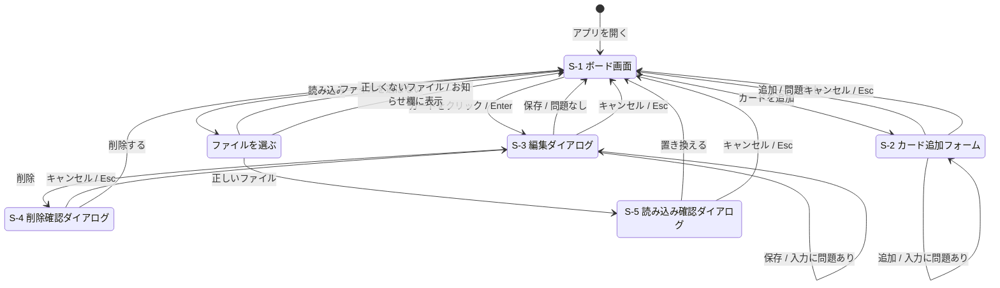

## 4. データ設計

### 4.1 画面の中で持つデータ

画面の中では、ボード全体を次の形で持つ。第1段階で `localStorage` に保存する形と、バックアップのファイルの形も、これと同じにする（要件定義書 8.2）。

```json
{
  "version": 1,
  "columns": {
    "todo": ["c-001", "c-002"],
    "doing": ["c-003"],
    "done": []
  },
  "cards": {
    "c-001": {
      "id": "c-001",
      "title": "要件定義書を書く",
      "memo": "機能と保存方法をまとめる",
      "dueDate": "2026-10-15",
      "priority": "high"
    },
    "c-002": {
      "id": "c-002",
      "title": "設計書を書く",
      "memo": "",
      "dueDate": null,
      "priority": null
    },
    "c-003": {
      "id": "c-003",
      "title": "画面を作る",
      "memo": "",
      "dueDate": "2026-10-20",
      "priority": "medium"
    }
  }
}
```

| 項目 | 内容 |
| --- | --- |
| `version` | データの形の版。今は `1` |
| `columns` | カラムごとに、入っているカードの id を、上から順に並べたもの。カラムは `todo`（未着手）、`doing`（作業中）、`done`（完了）の3つ |
| `cards` | カードの id をキーにして、カードの中身を引けるようにしたもの |

- カードの並び順は、`columns` の配列の順番で表す
- 1枚のカードは、必ずどれか1つのカラムに、1回だけ入る
- カードの id は、カードを作るときに画面の側で作る。重ならない値（UUID）を使う。サーバーの返事を待たずに画面へ出せるようにするためである（5.3 参照）
- 書き出したファイルには、このほかに書き出した日時 `exportedAt` を入れる

### 4.2 ER図（第2段階）

データベースには、ボード、カラム、カードの3つのテーブルを作る。利用者は自分1人なので、ユーザーのテーブルは作らない。

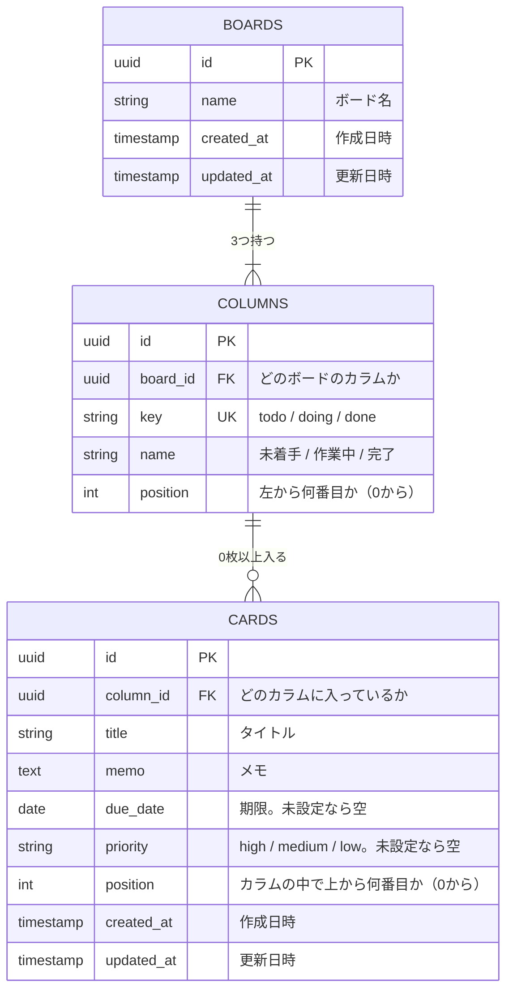

ボードは1つだけだが、テーブルとしては作っておく。「カラムはボードに属する」というつながりを、データの形で表すためである。

### 4.3 テーブルの定義

**BOARDS（ボード）**

| 列 | 型 | 空を許すか | 決まり |
| --- | --- | --- | --- |
| id | UUID | 許さない | 主キー |
| name | 文字列（100文字まで） | 許さない | |
| created_at | 日時 | 許さない | 作ったときの日時を自動で入れる |
| updated_at | 日時 | 許さない | 変えたときの日時を自動で入れる |

**COLUMNS（カラム）**

| 列 | 型 | 空を許すか | 決まり |
| --- | --- | --- | --- |
| id | UUID | 許さない | 主キー |
| board_id | UUID | 許さない | BOARDS の id を指す |
| key | 文字列 | 許さない | `todo`、`doing`、`done` のどれか。同じボードの中で重ならない |
| name | 文字列（20文字まで） | 許さない | |
| position | 整数 | 許さない | 0 以上 |

**CARDS（カード）**

| 列 | 型 | 空を許すか | 決まり |
| --- | --- | --- | --- |
| id | UUID | 許さない | 主キー。画面の側で作った値を使う |
| column_id | UUID | 許さない | COLUMNS の id を指す |
| title | 文字列（100文字まで） | 許さない | 空の文字は入れない |
| memo | 長い文字列（1000文字まで） | 許さない | 未入力なら空の文字を入れる |
| due_date | 日付 | 許す | |
| priority | 文字列 | 許す | `high`、`medium`、`low` のどれか |
| position | 整数 | 許さない | 0 以上 |
| created_at | 日時 | 許さない | 作ったときの日時を自動で入れる |
| updated_at | 日時 | 許さない | 変えたときの日時を自動で入れる |

- ボード1つとカラム3つは、データベースを最初に作るときに入れておく。画面から増やしたり消したりはしない
- 作成日時と更新日時は、データベースにだけ持つ。画面とバックアップのファイルには含めない。そのため、バックアップを読み込むと、作成日時と更新日時は読み込んだ日時になる

### 4.4 並び順の持ち方

カードの並び順は、CARDS の `position` に、カラムの中で上から 0、1、2… と番号を振って持つ。

カードを移動したときは、移動元と移動先のカラムで、番号を振り直す。

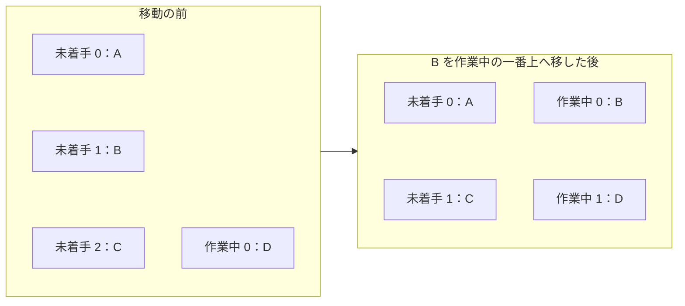

- 振り直しは、1回の移動につき、関係するカードの番号をまとめて変える。途中で失敗したときは、全部を元に戻す（トランザクション。要件定義書 9.3）
- カードは合計 200 枚までを想定しているので、毎回振り直しても速さに問題はない

### 4.5 画面のデータとテーブルの対応

| 画面の中のデータ | テーブルの列 |
| --- | --- |
| `columns` のキー（`todo` など） | COLUMNS.key |
| `columns` の配列の何番目か | CARDS.position |
| `cards` の id | CARDS.id |
| `title` | CARDS.title |
| `memo` | CARDS.memo |
| `dueDate` | CARDS.due_date |
| `priority` | CARDS.priority |

サーバーは、テーブルから読み出したデータを 4.1 の形に組み立ててから、画面に返す。

## 5. データの流れ

### 5.1 全体

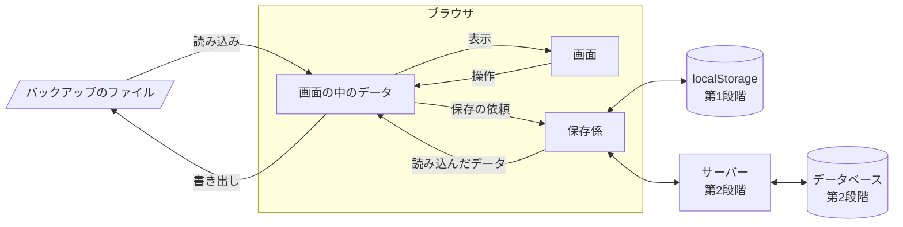

### 5.2 アプリを開いたとき

第1段階

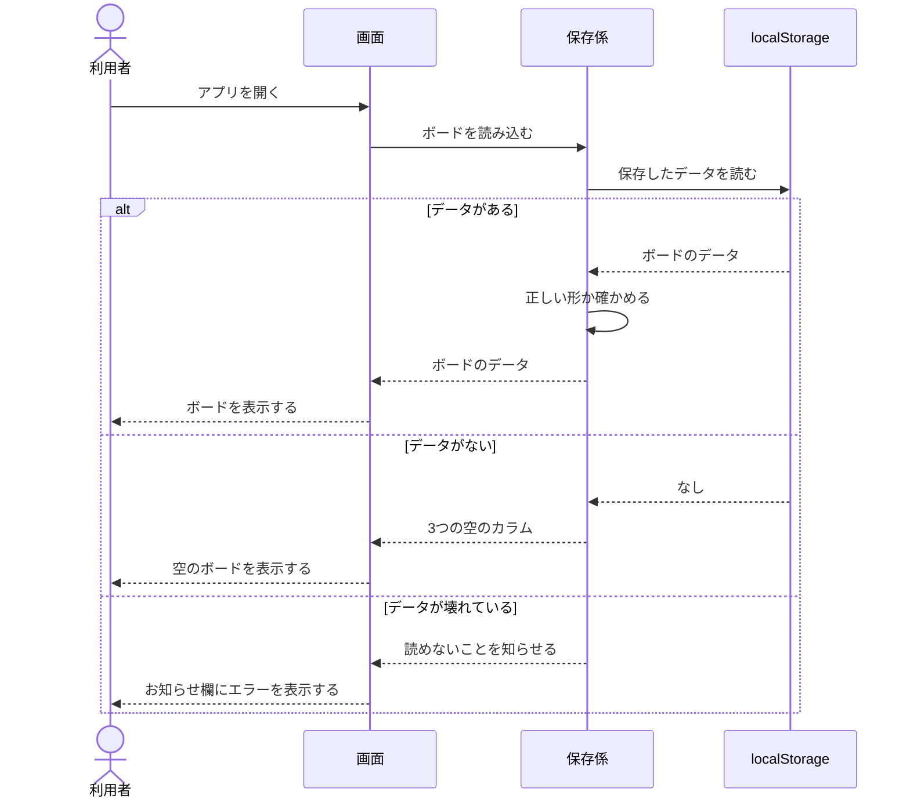

壊れたデータは消さずに残す（要件定義書 9.3）。

第2段階

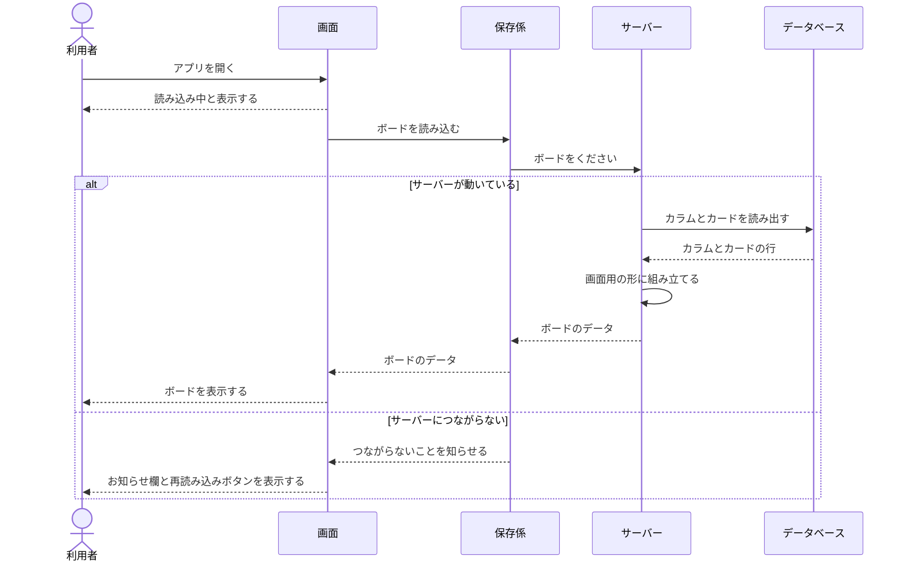

### 5.3 カードを追加、編集、削除したとき

画面のデータを先に書き換えて表示し、そのあとで保存する。保存に失敗したときは、画面のデータを操作の前に戻す。

こうすると、サーバーの返事を待たずに結果が画面に出るので、操作が速く感じられる（要件定義書 9.2）。特にドラッグ＆ドロップでは、返事を待つ間にカードが元の位置へ一瞬戻ってしまうことを防げる。

次の図は、第2段階でカードを追加するときの流れ。編集と削除も同じ流れになる。

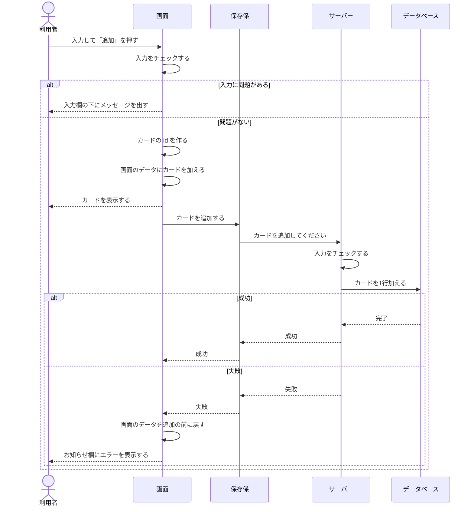

第1段階では、サーバーとデータベースの代わりに、保存係がボード全体を `localStorage` へ書き込む。

### 5.4 カードを移動、並べ替えたとき（第2段階）

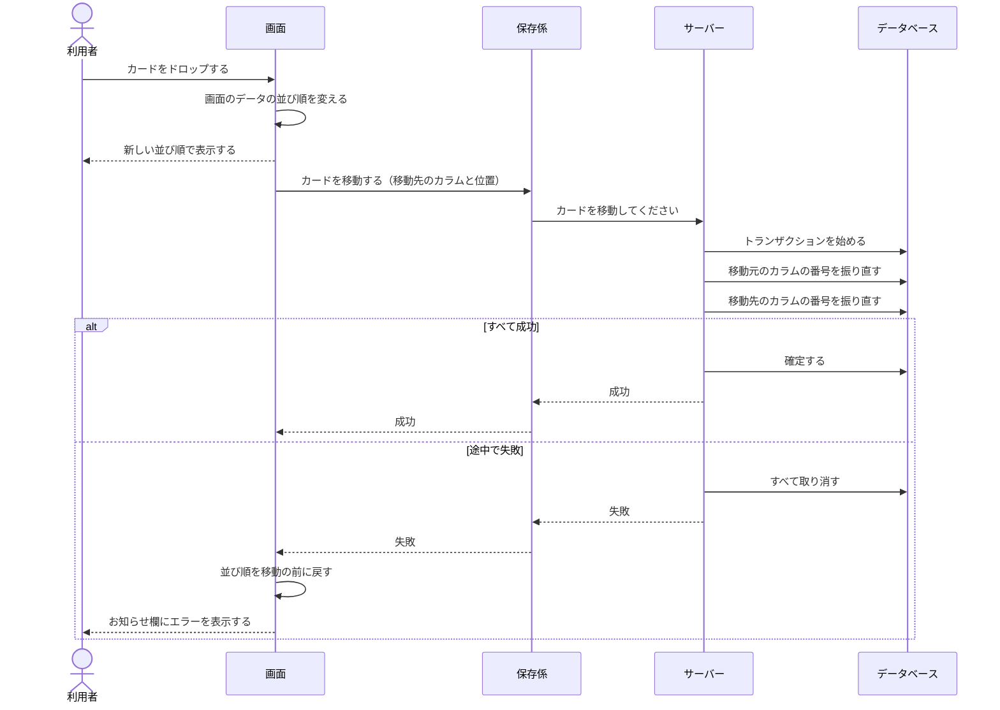

### 5.5 バックアップを書き出したとき

画面の中のデータを、そのままファイルにする。第2段階でも、サーバーには問い合わせない。

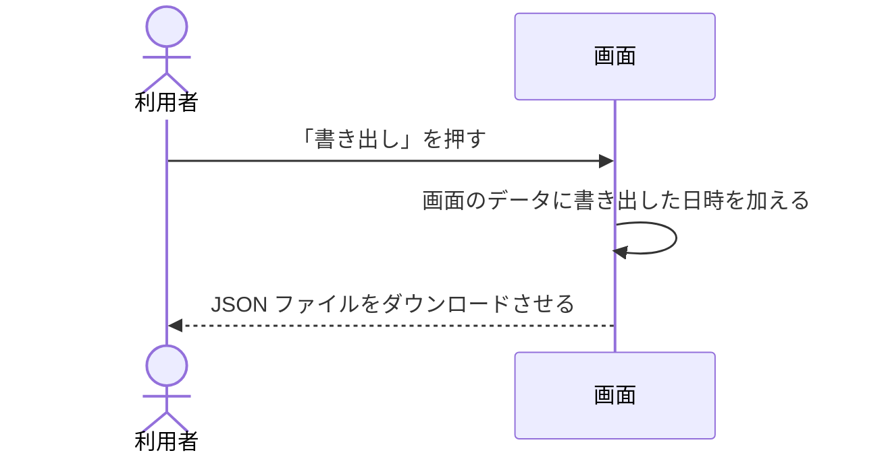

### 5.6 バックアップを読み込んだとき

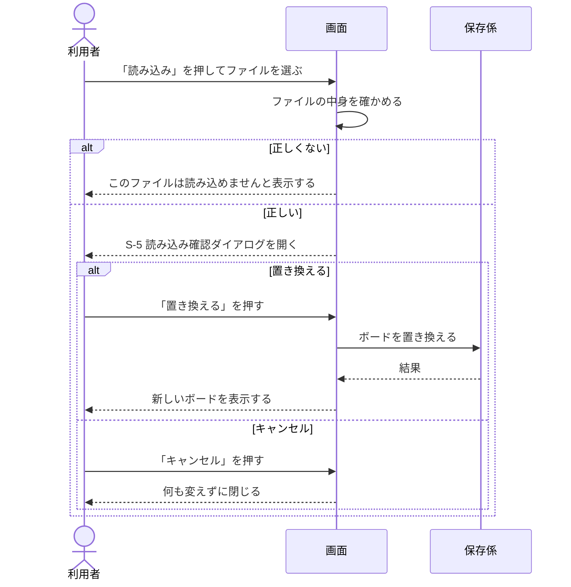

第2段階では、サーバーが「今のカードを全部消して、ファイルのカードを入れる」を1つのトランザクションで行う。途中で失敗したときは、読み込む前のボードのまま残る。

ファイルの中身は、次をすべて満たすときに正しいとする。

- JSON として読める
- `version` が `1`
- `columns` に `todo`、`doing`、`done` の3つがそろっている
- すべてのカードが、2.7 の入力のチェックを満たす
- すべてのカードが、どれか1つのカラムに1回だけ入っている
- `columns` に、`cards` にない id が入っていない

## 6. サーバーの窓口（第2段階）

画面の保存係がサーバーに頼むときの窓口（API）を、次のように分ける。送るデータと返すデータの細かい形は、詳細設計で決める。

| 保存係の仕事 | 方法 | 窓口 | 内容 |
| --- | --- | --- | --- |
| ボードを読み込む | GET | `/api/board` | ボード全体を 4.1 の形で返す |
| カードを追加する | POST | `/api/cards` | カードと、追加するカラムを送る |
| カードを更新する | PATCH | `/api/cards/{id}` | 変えた項目を送る |
| カードを削除する | DELETE | `/api/cards/{id}` | |
| カードを移動する | PUT | `/api/cards/{id}/position` | 移動先のカラムと、上から何番目かを送る |
| ボードを置き換える | PUT | `/api/board` | 4.1 の形のボード全体を送る |

- サーバーは、同じパソコンからの接続だけを受け付ける（要件定義書 9.6）
- サーバーで起きたエラーは、日時と内容をエラーの記録に残す（要件定義書 9.4）

## 7. あとで決めること

| 内容 | 決める時期 |
| --- | --- |
| データベースとサーバーに使う製品と言語 | 技術選定 |
| テーブルの作成や変更の手順の残し方 | 技術選定 |
| 窓口ごとの、送るデータと返すデータの細かい形 | 詳細設計 |
| 色、余白、文字の大きさ | 詳細設計 |
| 起動、停止、バックアップ、復元の手順書 | 第2段階の実装のとき |
