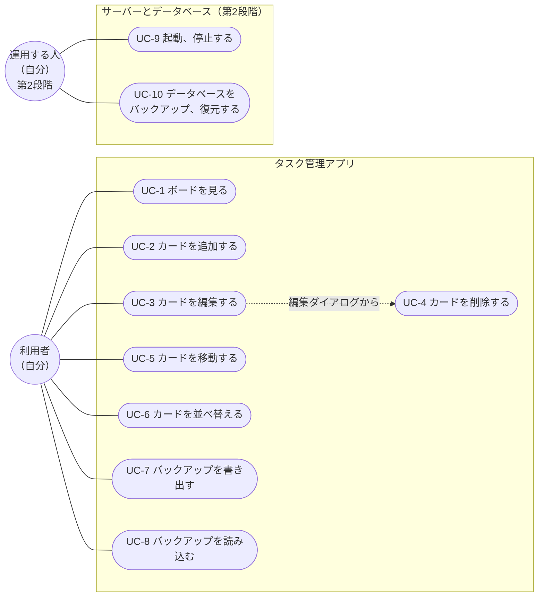
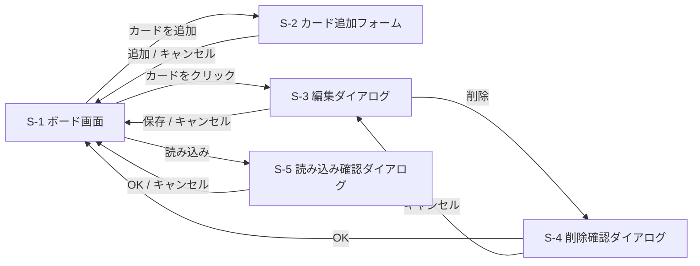

# タスク管理アプリ 要件定義書

| 項目 | 内容 |
| --- | --- |
| 文書名 | タスク管理アプリ 要件定義書 |
| 版 | 0.3 |
| 作成日 | 2026-10-09 |
| 更新日 | 2026-10-10 |
| 状態 | ドラフト |

## 改訂履歴

| 版 | 日付 | 内容 |
| --- | --- | --- |
| 0.1 | 2026-10-09 | 初版 |
| 0.2 | 2026-10-10 | 背景と目的を学習目的として書き直す。利用環境、ユースケース、操作フロー、画面構成、非機能要件、技術選定を追加する。バックアップとキーボード操作を対象範囲に加える。用語の章を削除する |
| 0.3 | 2026-10-10 | 開発を2段階に分け、第2段階でサーバーとデータベースに保存する形にする。運用の要件を追加する。技術選定のうちサーバーとデータベースは、基本設計のあとで決めることにする。対応ブラウザを、Chrome だけから主要なブラウザすべてに広げる。主な機能の一覧とユースケース図を追加する。カードの「説明文」を「メモ」に改める |

## 1. 背景と目的

### 1.1 背景

スクールの課題として、Trello 風のタスク管理アプリを作る。業務上の困りごとを解決するためのものではなく、Web アプリ開発を一通り経験するための学習が主な目的である。作ったあとは、自分のタスク管理に実際に使う。

画面だけのアプリで終わらせず、サーバーとデータベースを使い、自分で運用するところまでを経験する。

### 1.2 主な機能

| 機能 | 内容 | 詳しくは |
| --- | --- | --- |
| ボード | タスクを管理する画面。1つだけ持つ | 6章、7.1 |
| カラム（列） | タスクの状態を表す区分。「未着手」「作業中」「完了」の3つで固定 | 7.1 |
| カード | タスク1件。タイトル、メモ、期限、優先度を持つ。追加、編集、削除ができる | 7.2〜7.4、8.1 |
| ドラッグ＆ドロップ | カードを別のカラムへ動かして、タスクの状態を変える。同じカラムの中での並べ替えもできる | 7.5、7.6 |

### 1.3 学習の目標

このアプリを作ることで、次を身につける。

| 目標 | 内容 |
| --- | --- |
| 開発の流れ | 要件定義、基本設計、実装、確認の順に進め、各段階で何を決めるかを体験する |
| React | 画面を部品（コンポーネント）に分け、状態の変化に合わせて画面を更新する |
| TypeScript | カードやボードのデータの形を型で決め、間違いをエディタで見つける |
| ライブラリの利用 | 外部のライブラリ（dnd-kit）を調べて導入し、使いこなす |
| ブラウザへの保存 | `localStorage` でデータを保存し、読み込む |
| データベースの設計 | ER図を書き、それをもとにテーブルを作る |
| サーバーとの通信 | 画面からサーバーへデータを送り、サーバーがデータベースに保存する仕組みを作る |
| 運用 | サーバーとデータベースの起動、停止、バックアップ、復元を、手順書どおりに行う |
| Git と GitHub | 変更を小さく分けてコミットし、履歴を残す |

### 1.4 開発の段階

一度に覚えることを減らすため、開発を2段階に分ける。

| 段階 | 内容 | 保存先 |
| --- | --- | --- |
| 第1段階 | 画面と操作をすべて作り、ブラウザの中だけで動くアプリを完成させる | ブラウザの `localStorage` |
| 第2段階 | サーバーとデータベースを用意し、保存先を差し替える。画面の操作は第1段階と変えない | 自分のパソコン上のデータベース |

第1段階のデータは、バックアップのファイルを使って第2段階へ移す。

### 1.5 完成の基準

第11章の受け入れ条件を段階ごとにすべて満たし、作ったものの仕組みを自分の言葉で説明できる状態を、その段階の完成とする。

## 2. 利用者と利用環境

### 2.1 利用者

利用者は自分1人。ログインはしない。

### 2.2 利用環境

| 項目 | 内容 |
| --- | --- |
| 端末 | Windows のパソコン1台 |
| ブラウザ | 主要なブラウザ（Chrome、Edge、Firefox、Safari）の最新版。どれでも使えるようにする |
| 画面の幅 | 横幅 1280px 以上を想定する |
| 入力機器 | マウスとキーボード |
| 起動方法 | 第1段階：自分のパソコン上でアプリを起動し、ブラウザで開く<br>第2段階：自分のパソコン上でデータベースとサーバーも起動してから、ブラウザで開く |
| 公開 | インターネットには公開しない。自分のパソコンの中だけで使う |

## 3. 対象範囲

### 3.1 作るもの

- ボードは1つ
- カラムは「未着手」「作業中」「完了」の3つで固定
- カードの追加、編集、削除
- ドラッグ＆ドロップによる、カラム間の移動と、同じカラムの中での並べ替え
- キーボードだけでの操作（カードの追加、編集、削除、移動、並べ替え）
- ブラウザを閉じたあとも内容が残る保存（第1段階は `localStorage`、第2段階はデータベース）
- データのバックアップ（ファイルへの書き出しと、ファイルからの読み込み）
- 第2段階：画面とデータベースの間を取り持つサーバー
- 第2段階：運用の手順書（起動、停止、バックアップ、復元）

### 3.2 作らないもの

- 複数のユーザーへの対応（ユーザーの登録、ログイン、ユーザーごとのデータの分け方）。第2段階でサーバーとデータベースを使っても、利用者は自分1人のままとする
- 複数人での共有、担当者
- 複数のボード
- カラムの追加、名前の変更、削除
- 期限や優先度による自動の並べ替え
- スマホなど、ほかの端末からの利用
- インターネットへの公開
- 自動テスト（動作の確認は手で行う）

## 4. ユースケース

利用者（自分）がこのアプリでできることを、次の表にまとめる。

| 番号 | ユースケース | 概要 |
| --- | --- | --- |
| UC-1 | ボードを見る | 3つのカラムと、そこにあるカードを一覧する |
| UC-2 | カードを追加する | 新しいタスクをカードとして登録する |
| UC-3 | カードを編集する | カードの内容を書き換える |
| UC-4 | カードを削除する | 不要になったカードを消す |
| UC-5 | カードを移動する | カードを別のカラムへ移し、タスクの状態を変える |
| UC-6 | カードを並べ替える | 同じカラムの中で、カードの順番を変える |
| UC-7 | バックアップを書き出す | ボード全体のデータをファイルに保存する |
| UC-8 | バックアップを読み込む | 書き出したファイルから、ボード全体を元に戻す |

第2段階では、利用者が「運用する人」として次も行う。

| 番号 | ユースケース | 概要 |
| --- | --- | --- |
| UC-9 | 起動、停止する | データベースとサーバーを起動し、使い終わったら停止する |
| UC-10 | データベースをバックアップ、復元する | データベースの中身を丸ごと保存し、必要なときに元に戻す |

### 4.1 ユースケース図

利用者と運用する人は、どちらも自分である。役割の違いがわかるように、図では分けて書く。



UC-4 カードを削除する は、UC-3 の編集ダイアログの中から行う。

## 5. 操作フロー

各ユースケースで、利用者がどう操作し、アプリがどう応えるかを示す。UC-1 から UC-8 の操作は、第1段階と第2段階で同じとする。

### UC-1 ボードを見る

1. 利用者がブラウザでアプリを開く
2. アプリは保存したデータを読み込み、ボード画面を表示する
3. 保存したデータがないときは、3つの空のカラムを表示する

### UC-2 カードを追加する

1. 利用者が、カラムの下にある「カードを追加」を押す
2. アプリは、そのカラムの中に入力欄を開く
3. 利用者がタイトルなどを入力し、「追加」を押す
4. アプリは、そのカラムの一番下にカードを入れ、保存する
5. 「キャンセル」を押した場合は、何も追加せずに入力欄を閉じる

### UC-3 カードを編集する

1. 利用者がカードをクリックする
2. アプリは編集ダイアログを開き、今の内容を表示する
3. 利用者が内容を書き換え、「保存」を押す
4. アプリはカードを更新して保存し、ダイアログを閉じる
5. 「キャンセル」を押した場合は、変更を捨ててダイアログを閉じる

### UC-4 カードを削除する

1. 利用者が編集ダイアログで「削除」を押す
2. アプリは「本当に削除しますか？」と確認を出す
3. 利用者が「OK」を押すと、カードを消して保存し、ダイアログを閉じる
4. 「キャンセル」を押すと、消さずに編集ダイアログへ戻る

### UC-5 カードを移動する ／ UC-6 カードを並べ替える

1. 利用者がカードをつかみ、移したい位置まで動かす
2. アプリは、動かしている間、入る位置がわかるように表示する
3. 利用者がカードを離す
4. アプリは、離した位置にカードを入れて保存する

### UC-7 バックアップを書き出す

1. 利用者が、ボード画面の「書き出し」を押す
2. アプリは、ボード全体のデータを1つのファイルとしてダウンロードさせる

### UC-8 バックアップを読み込む

1. 利用者が、ボード画面の「読み込み」を押し、ファイルを選ぶ
2. アプリは「今のボードは、読み込んだ内容で置き換わります。よろしいですか？」と確認を出す
3. 利用者が「OK」を押すと、ボードを読み込んだ内容に置き換えて保存する
4. 「キャンセル」を押すと、何も変えない
5. ファイルの中身が正しくないときは、エラーを表示し、ボードは変えない

### UC-9 起動、停止する（第2段階）

1. 利用者が、手順書どおりにデータベースとサーバーを起動する
2. ブラウザでアプリを開いて使う
3. 使い終わったら、手順書どおりにサーバーとデータベースを停止する

### UC-10 データベースをバックアップ、復元する（第2段階）

1. 利用者が、手順書どおりにデータベースのバックアップを取る
2. データが壊れたり消えたりしたときは、手順書どおりにバックアップから復元する
3. 復元したあとにアプリを開き、ボードが元に戻っていることを確かめる

## 6. 画面構成

### 6.1 画面の一覧

| 番号 | 画面 | 内容 |
| --- | --- | --- |
| S-1 | ボード画面 | アプリを開くと表示されるメインの画面。3つのカラムとカードを並べる |
| S-2 | カード追加フォーム | カラムの中に開く入力欄。別の画面には移らない |
| S-3 | 編集ダイアログ | カードをクリックすると、ボード画面の上に重ねて開く |
| S-4 | 削除確認ダイアログ | 編集ダイアログで「削除」を押すと開く |
| S-5 | 読み込み確認ダイアログ | バックアップを読み込む前に開く |

画面ごとの項目、ボタン、表示のルールは、基本設計書で決める。

### 6.2 画面の移り方



### 6.3 画面のイメージ

S-1 ボード画面

```text
+--------------------------------------------------------------------+
| タスク管理                                      [書き出し] [読み込み] |
+--------------------------------------------------------------------+
| 未着手              | 作業中              | 完了                     |
| +----------------+ | +----------------+ | +----------------+        |
| | 要件定義書を書く | | | 画面を作る       | | | リポジトリを作る |        |
| | 10/15  優先度:高 | | | 10/20  優先度:中 | | |                |        |
| +----------------+ | +----------------+ | +----------------+        |
| +----------------+ |                    |                          |
| | 設計書を書く     | |                    |                          |
| +----------------+ |                    |                          |
| [+ カードを追加]    | [+ カードを追加]    | [+ カードを追加]          |
+--------------------------------------------------------------------+
```

S-3 編集ダイアログ

```text
+------------------------------------+
| カードを編集                         |
|                                    |
| タイトル [要件定義書を書く          ] |
| メモ     [機能と保存方法をまとめる   ] |
|          [                         ] |
| 期限     [2026-10-15] (カレンダー)   |
| 優先度   [高 ▼]                     |
|                                    |
| [削除]            [キャンセル] [保存] |
+------------------------------------+
```

見た目の細かい部分（色、余白、文字の大きさ）は、基本設計で決める。

## 7. 機能要件

### 7.1 ボードを表示する

- 3つのカラムを、左から「未着手」「作業中」「完了」の順に横に並べて表示する
- 各カラムには、そのカラムのカードを上から順に表示する
- カードには、タイトル、期限、優先度を表示する

### 7.2 カードを追加する

カラムごとの「カードを追加」から、次の項目を入力して追加する。

| 項目 | 入力 | 内容 |
| --- | --- | --- |
| タイトル | 必須 | 1行の文字 |
| メモ | 任意 | 複数行の文字 |
| 期限 | 任意 | 日付（年・月・日）。カレンダーから選べる |
| 優先度 | 任意 | 高、中、低から1つ |

- 追加したカードは、そのカラムの一番下に入る
- 入力内容の細かいルール（文字数の上限など）は、基本設計で決める

### 7.3 カードを編集する

- カードをクリックすると、編集ダイアログが開く
- タイトル、メモ、期限、優先度を書き換えられる
- 「保存」で内容を更新し、「キャンセル」では変更前の内容のままにする

### 7.4 カードを削除する

- 編集ダイアログの「削除」で、カードを消す
- 消す前に確認を出し、「キャンセル」を選ぶと消さずに残す

### 7.5 ドラッグ＆ドロップで移動する

- カードを別のカラムへドロップすると、そのカラムへ移動する。これでタスクの状態が変わる
- ドロップした位置にカードを入れる
- 同じカラムの中でも、ドロップした位置へ並べ替えられる
- 並び順は手で決めた順番のままとし、自動では並べ替えない

### 7.6 キーボードで操作する

マウスを使わずに、すべての操作ができるようにする。

| 操作 | キー |
| --- | --- |
| ボタンやカードの間を移る | Tab（戻るときは Shift + Tab） |
| ボタンを押す、カードの編集ダイアログを開く | Enter |
| ダイアログを閉じる（キャンセルと同じ） | Esc |
| カードをつかむ、離す | Space |
| つかんだカードを動かす | 矢印キー |
| つかんだカードを元の位置へ戻す | Esc |

- 今どこを選んでいるかが、見た目でわかるようにする

### 7.7 保存する

- 追加、編集、削除、移動、並べ替え、読み込みのたびに、すぐ保存する
- 第1段階では、ボード全体をブラウザの `localStorage` へ保存する
- 第2段階では、サーバーを通してデータベースへ保存する
- 画面を開いたときは、保存したデータを読み込む
- 保存したデータがないときは、3つの空のカラムから始める
- 保存に失敗したときは、画面にエラーを表示する
- 第2段階で、サーバーやデータベースが止まっていてつながらないときは、そのことを画面に表示する

### 7.8 バックアップする

- 「書き出し」で、ボード全体を JSON 形式のファイルとしてダウンロードする
- ファイル名には書き出した日付を入れる（例：`task-board-2026-10-10.json`）
- 「読み込み」で、書き出したファイルを選ぶと、確認のあとでボード全体を置き換える
- 正しくないファイルを選んだときは、エラーを表示し、ボードは変えない
- 第1段階で書き出したファイルを、第2段階で読み込めるようにする。これを第1段階から第2段階へのデータの引っ越しに使う

## 8. データ

### 8.1 カード

カード1件は、次の項目を持つ。

| 項目 | 形式 | 例 |
| --- | --- | --- |
| id | 文字列。カードごとに重ならない値 | `3f2a9c1e-...` |
| title | 文字列 | `要件定義書を書く` |
| memo | 文字列 | `機能と保存方法をまとめる` |
| dueDate | 日付の文字列、または未設定 | `2026-10-15` |
| priority | `high` / `medium` / `low`、または未設定 | `high` |

- 画面の「高」「中」「低」は、データでは `high`、`medium`、`low` とする
- `id` は画面に出さない

### 8.2 ボード

- ボードは、すべてのカードと、各カラムにどのカードがどの順番で入っているかを持つ
- バックアップのファイルの形は、第1段階と第2段階で同じにする
- データの形が将来変わっても見分けられるように、データの版（バージョン）を一緒に保存する

### 8.3 データベース（第2段階）

- ボード、カラム、カードを、データベースのテーブルとして持つ
- テーブルの形とつながりは、基本設計書の ER 図で決める
- カードの作成日時と更新日時も記録する

## 9. 非機能要件

### 9.1 動作環境

| 要件 | 内容 |
| --- | --- |
| 対応ブラウザ | 主要なブラウザ（Chrome、Edge、Firefox、Safari）の最新版で使える。どのブラウザでも同じ操作ができ、同じように表示される |
| 作り方 | 特定のブラウザでしか動かない機能は使わない。主要なブラウザがそろって対応している機能だけで作る |
| 動作の確認 | Windows で確かめられる Chrome、Edge、Firefox の最新版で、受け入れ条件を確認する。Safari は Mac が必要なため、確認できる環境があるときに行う |
| 対象外 | Internet Explorer など、提供が終わったブラウザ |
| 画面の幅 | 横幅 1280px 以上で、3つのカラムが横に並んで見える |
| サーバーとデータベース（第2段階） | 画面と同じ、自分のパソコンの上で動かす |

### 9.2 性能

| 要件 | 内容 |
| --- | --- |
| 扱える量 | カードが合計 200 枚あっても、次の速さを保つ |
| 表示の速さ | アプリを開いてから、1秒以内にボードが表示される |
| 操作の速さ | 追加、編集、削除、移動の結果が、待たされたと感じずに（目安 0.1 秒以内に）画面に出る |
| ドラッグの滑らかさ | ドラッグ中のカードが、カクつかずにマウスについてくる |

カード 200 枚は、個人のタスク管理で一度に抱える量としては十分に多い数として決めた。第2段階でも同じ速さを目標とする。

### 9.3 データの保全

| 要件 | 内容 |
| --- | --- |
| 保存のタイミング | 変更のたびにすぐ保存する。「保存し忘れ」が起きないようにする |
| 保存の失敗 | 保存できなかったときは、画面で知らせる。黙って失敗しない |
| 読み込みの失敗 | 保存したデータが壊れていて読めないときは、エラーを表示する。壊れたデータは勝手に消さない |
| 画面からのバックアップ | 書き出したファイルから、ボード全体を元に戻せる |
| データの整合（第2段階） | 移動や並べ替えで複数のカードの順番が変わるときは、全部が変わるか、全部が変わらないかのどちらかにする。途中まで変わった状態を残さない |

### 9.4 運用（第2段階）

| 要件 | 内容 |
| --- | --- |
| 起動と停止 | 手順書どおりに、決まったコマンドで起動、停止できる |
| データベースのバックアップ | 週に1回、手順書どおりにデータベースのバックアップを取る |
| 復元 | バックアップから復元する手順を、実際に一度試して確かめておく |
| 手順書 | 起動、停止、バックアップ、復元の手順を、リポジトリの中に文書として残す |
| エラーの記録 | サーバーで起きたエラーは、あとから見返せるように記録する |

### 9.5 使いやすさとアクセシビリティ

| 要件 | 内容 |
| --- | --- |
| キーボード操作 | 7.6 のとおり、マウスなしですべての操作ができる |
| 選択中の表示 | キーボードで今どこを選んでいるかが、枠線などで見てわかる |
| 取り消しにくい操作 | 削除と、バックアップの読み込みの前には、必ず確認を出す |
| 文字の読みやすさ | 文字と背景の色の差を十分にとり、読みにくい色の組み合わせを使わない |

### 9.6 セキュリティ

| 要件 | 内容 |
| --- | --- |
| 公開範囲 | インターネットに公開しない。第2段階のサーバーは、同じパソコンからの接続だけを受け付ける |
| 入力した文字の表示 | カードに入力した文字は、文字としてそのまま表示する。HTML として解釈させない |
| 受け取ったデータの確認 | バックアップのファイルや、サーバーが受け取ったデータは、正しい形かを確かめてから使う |
| データベースへの命令（第2段階） | 入力した文字が、データベースへの命令として実行されないようにする |
| 接続情報（第2段階） | データベースのパスワードなどは、GitHub に上げない |

### 9.7 保守性

| 要件 | 内容 |
| --- | --- |
| コードの分け方 | 画面の部品、データの操作、保存の処理を分けて書く。保存先を `localStorage` からデータベースへ差し替えても、画面の部品を書き換えずに済むようにする |
| 型 | カードとボードのデータの形を TypeScript の型で決める |
| 書き方の統一 | ESLint で、コードの書き方の間違いを見つける |
| テーブルの変更（第2段階） | テーブルの作成や変更の手順を、ファイルとして残す。手で直接テーブルを変えない |
| 履歴 | 変更は Git で小さく分けてコミットする |

## 10. 技術選定

第1段階で使う画面側の技術は、次のとおり仮に決める。第2段階で使うサーバーとデータベースの技術は、基本設計で画面とデータの形を決めたあとに選ぶ。基本設計の結果によっては、画面側の技術も見直す。

### 10.1 第1段階（画面側）

| 分類 | 使うもの | 選んだ理由 |
| --- | --- | --- |
| 言語 | TypeScript | データの形を型で決めておくと、書き間違いをエディタが教えてくれる。仕事でもよく使われ、学習目的に合う |
| 画面の部品 | React | 画面を部品に分けて作れる。利用者が多く、調べたときに情報が見つかりやすい |
| 開発の道具 | Vite | 準備が簡単で、変更がすぐ画面に反映される。React と TypeScript のひな形がある |
| ドラッグ＆ドロップ | dnd-kit | カラム間の移動と並べ替えが作りやすい。キーボードでの操作にも対応している |
| 保存先 | `localStorage` | ブラウザに最初から入っていて、サーバーを用意しなくてよい |
| 見た目 | CSS | 追加の道具を使わず、CSS の基本を身につける |
| コードの点検 | ESLint | Vite のひな形に含まれている |
| 履歴の管理 | Git、GitHub | 課題の提出と、変更履歴の管理に使う |

選ばなかったもの

| 候補 | 選ばなかった理由 |
| --- | --- |
| JavaScript | 手軽だが、型がないため間違いに気づきにくい |
| ブラウザ標準のドラッグ＆ドロップ | 並べ替えの位置の計算を自分で書く必要があり、キーボード操作にも対応しにくい |

### 10.2 第2段階（サーバーとデータベース）

基本設計のあとで、次を決める。

| 分類 | 決めること |
| --- | --- |
| データベース | どのデータベースを使うか |
| サーバー | どの言語と道具でサーバーを作るか |
| データベースとのやり取り | SQL を直接書くか、道具を使うか |
| テーブルの変更の管理 | テーブルの作成や変更の手順を、どう残すか |
| 起動の方法 | データベースとサーバーを、パソコン上でどう動かすか |

## 11. 受け入れ条件

Chrome、Edge、Firefox の最新版のそれぞれで、次をすべて手で確認できれば、その段階の要件を満たしたとする。

### 11.1 第1段階

1. カードを、タイトル、メモ、期限、優先度付きで追加できる
2. タイトルが空のカードは、追加も保存もできない
3. 既存のカードの4項目を編集でき、キャンセルすると元のままになる
4. カードを削除できる。削除の前に確認が出て、キャンセルすると消えずに残る
5. カードを、別のカラム、および同じカラムの好きな位置へ、ドラッグ＆ドロップで移せる
6. 1〜5 の操作を、マウスを使わずキーボードだけでできる
7. ブラウザを閉じ、同じブラウザで開き直しても、カラムとカードの内容と並び順が残っている
8. 書き出したファイルを読み込むと、書き出したときのボードに戻る。読み込みの前に確認が出る
9. 正しくないファイルを読み込もうとすると、エラーが出て、ボードは変わらない
10. カードが 200 枚あっても、9.2 の速さで動く

### 11.2 第2段階

1. 第1段階の 1〜10 が、保存先をデータベースにした状態でもすべて満たせる
2. 第1段階で書き出したファイルを読み込むと、同じボードがデータベースに入る
3. サーバーとデータベースを停止して起動し直しても、カラムとカードの内容と並び順が残っている
4. サーバーを止めた状態で操作すると、つながらないことが画面に表示される
5. 手順書どおりにデータベースのバックアップを取り、そこから復元すると、バックアップを取ったときのボードに戻る
6. 移動や並べ替えの途中でサーバーを止めても、カードの順番が壊れない

## 12. 制約とリスク

| 内容 | 対策 |
| --- | --- |
| ブラウザのサイトデータを削除すると、第1段階のカードは消える | バックアップの書き出しで備える |
| シークレットウィンドウ（Edge では InPrivate ウィンドウ）で開くと、閉じたときに第1段階のカードが消える | 普段のウィンドウで使う |
| `localStorage` は、開いた URL（ポート番号を含む）ごとに別になる。起動するたびにポート番号が変わると、前のカードが見えなくなる | 起動するポート番号を固定する |
| `localStorage` に保存できる量には上限がある（ブラウザによって違うが、およそ 5MB） | 9.2 の量（カード 200 枚）なら上限に届かない。保存に失敗したときは画面で知らせる |
| 第1段階では、`localStorage` がブラウザごとに別になる。Chrome で作ったカードは、Edge で開くと見えない | 普段使うブラウザを1つに決める。ほかのブラウザへ移すときは、バックアップのファイルを使う。第2段階では、同じパソコンならどのブラウザで開いても同じカードが見える |
| 第2段階では、サーバーとデータベースを起動し忘れると使えない | 起動の手順を手順書にまとめる。つながらないときは画面で知らせる |
| 第2段階でも、パソコンが壊れるとデータベースごとデータが消える | データベースのバックアップを、パソコンの外（USB メモリなど）にも置く |
| 別のパソコンやスマホでは、カードは見えない | 対象範囲の外とする |
| 第2段階は覚えることが多く、時間がかかるおそれがある | 第1段階を先に完成させ、使える状態を確保してから取りかかる |
